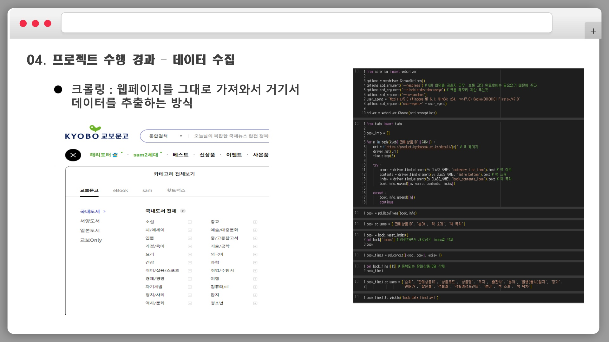

# 1차 프로젝트

## 책 추천 AI

## 프로젝트 기획 의도
- 처음 교양수업 관련하여 과제를 하는 학부 1~2학년 학생들에게 과제에 쉽게 접근할 수 있는 자료를 추천하여, 과제의 방향성을 잡는데 도움을 준다.

## 활용 장비 및 재료
- 파이썬, 구글 코랩, 
selenium, pandas, konlpy(Hannanum), summa(TextRank)

## 데이터 수집

## 데이터 전처리
- 이상치 및 결측치 제거
- Hannanum 을 사용하여 문장들을 토큰화, 불용어 제거, 명사화 진행

## 모델링
- 전처리한 소개글과 목차를 TextRank를 통해 키워드를 추출
- 사용자로부터 받은 인풋값을 TextRank를 통해 키워드 추출
- 키워드를 Jaccard Similarity를 통해 가장 유사한 책을 추천