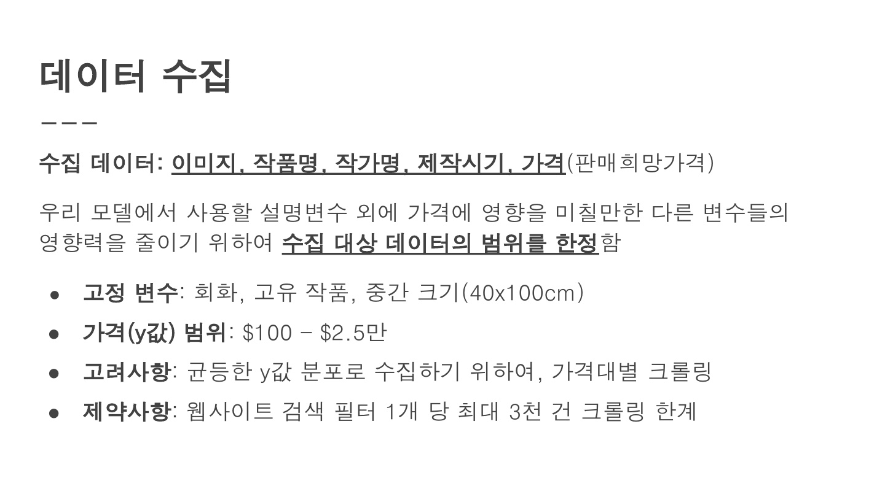
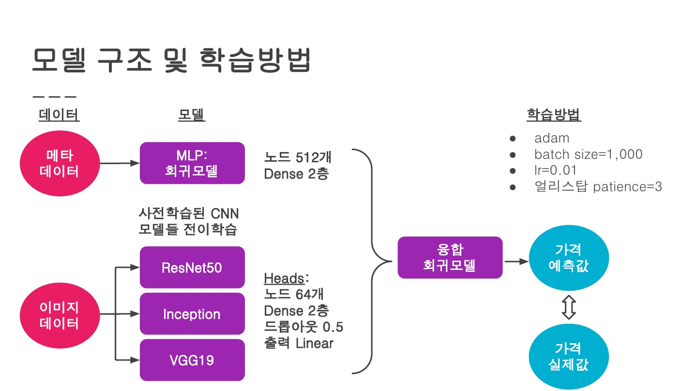
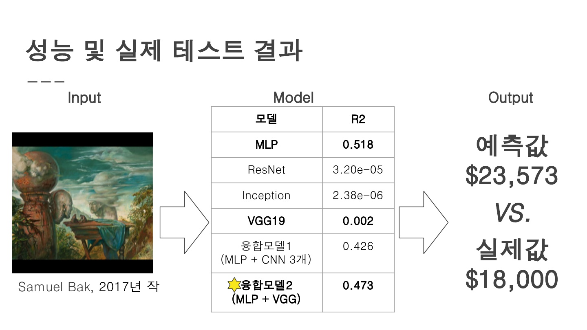

# 3차 프로젝트

## 미술품 가치 예측 AI

## 프로젝트 기획 의도
- 미술품을 소장하는 취미는 심리적 만족감과 금전적 만족감을 동시에 기대할 수 있지만, 시장 진입장벽이 높은 편이기에 이를 낮추고자 하였다.

## 활용 장비 및 재료
- 파이썬, 구글 코랩, 
BeautifulSoup, request, pandas, scikit-learn, matplotlib, Tensorflow

## 데이터 수집

## 데이터 전처리
- 이상치 및 결측치 제거, 데이터 갯수가 많은 작가만 남겨 총 1.3만개의 데이터 사용
- 다양한 통화를 USD 기준으로 환전하여 사용
- 가격이 범위로 되어있는 경우 최소값을 사용

## 모델링

## 생성 결과

## 수행역할
- 크롤링으로 받은 데이터를 EDA를 통해 전처리 수행
- 관련된 문헌들을 참고하여 모델 구축, 학습 및 성능개선