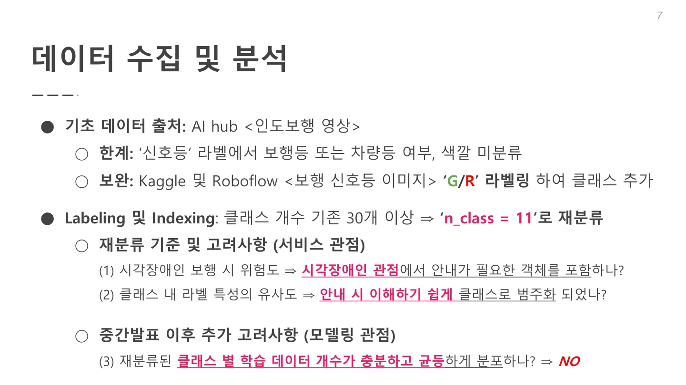
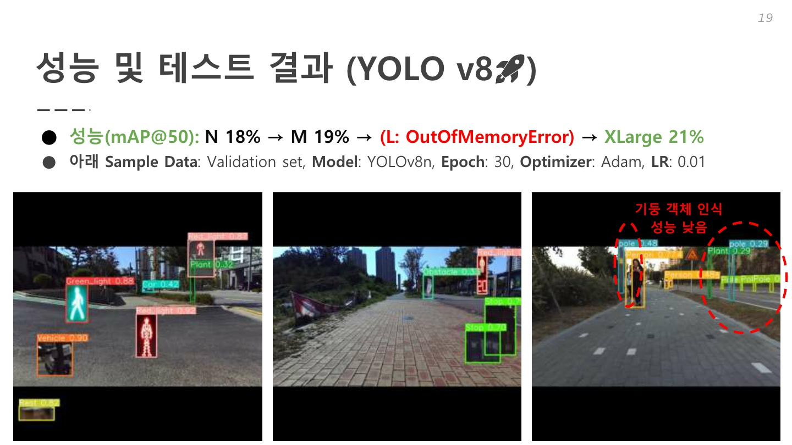

# 4차 프로젝트

## 장애물 탐지 AI

## 프로젝트 기획 의도
- 많은 시각장애인이 문밖을 나서는 것조차 어려움을 느끼는데, 안내견이나 점자블록 등 보행을 보조하기 위한 수단들은 부족한 상황인데, 객체인식 기술을 활용하여 안전 보행 보조 솔루션을 제공하고자 한다.

## 활용 장비 및 재료
- 파이썬, 구글 코랩, 
Darknet, PIL, OpenCV, ultralytics

## 데이터 수집

## 데이터 전처리
- 이미지들을 일관적으로 리사이징을 하고, Bbox좌표를 모델의 요구에 맞게 변경, 이후 일부 클래스의 데이터를 보완하기 위해 이미지 합성을 사용하여 데이터 증강을 실시하였다.

## 생성 결과

## 수행역할
- 프로젝트 초기 프로젝트에 부합하는 데이터 수집
- 라벨들간 데이터 불균형이 심하여, opencv를 통해 이미지를 합성하여 데이터 증강
- YOLOv4, YOLOv8의 n, m, x 모델을 학습하여 성능비교
